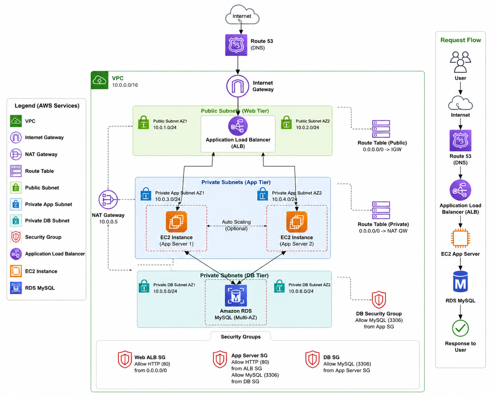

# AWS Three-Tier Architecture

## Architecture Diagram

---

## Overview

This project demonstrates a highly available and secure AWS Three-Tier Architecture using Amazon VPC, EC2, Application Load Balancer, NAT Gateway, Internet Gateway, and Amazon RDS.

---

## Components

- Amazon VPC
- Public Subnets
- Private App Subnets
- Private DB Subnets
- Internet Gateway
- NAT Gateway
- Route Tables
- Security Groups
- Amazon EC2
- Application Load Balancer
- Amazon RDS MySQL

---

## Request Flow

1. User sends a request.
2. Request reaches the Application Load Balancer.
3. ALB forwards traffic to EC2 Application Servers.
4. Application Servers communicate with Amazon RDS.
5. Response is returned to the user.

---

## High Availability Features

- Multi Availability Zones
- Public and Private Subnets
- Application Load Balancer
- NAT Gateway
- Database in Private Subnets
- Secure Security Groups